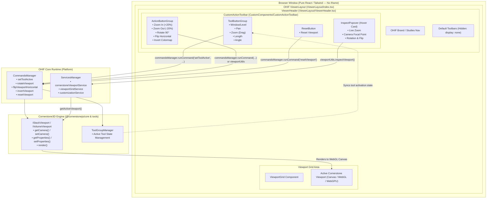
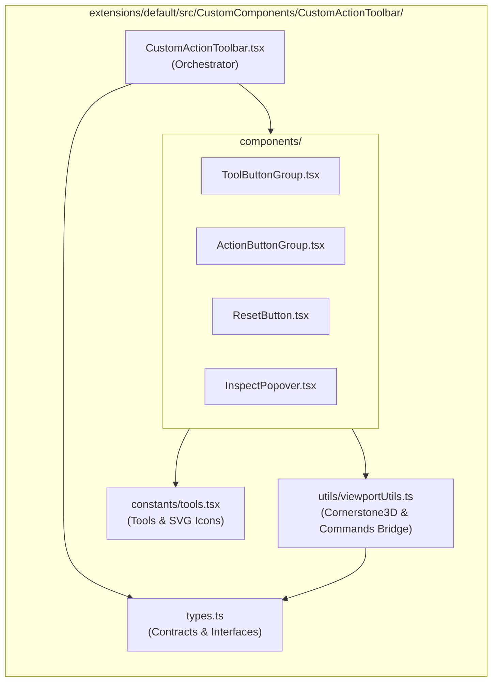

# OHIF UI Wrapper (React + Tailwind CSS)

A pure **React.js + Tailwind CSS** UI wrapper over the **OHIF Medical Imaging Viewer** (v3 monorepo) and **Cornerstone3D**, providing custom viewport controls, annotations, and real-time inspection without using iframes.

---

## 🌟 Key Features

- **No Iframe (In-Process Integration):** Runs directly in OHIF's React component hierarchy and memory space for zero-latency interactions and direct access to OHIF services.
- **Custom Modular Action Toolbar:** Clean, modern header controls with Tailwind styling replacing default OHIF primary/secondary toolbars.
- **Interactive Medical Tools:**
  - **Window / Level (W/L):** Dynamic brightness/contrast adjustment with active indicators.
  - **Pan:** Pan canvas across viewports.
  - **Zoom (Drag):** Interactive drag-based viewport zooming.
  - **Length & Angle Annotations:** Precision medical measurement tools.
- **Instant One-Click Viewport Actions:**
  - **Zoom In / Out:** Instant discrete zoom adjustments (`+20%` / `-20%`).
  - **Rotate 90°:** Instant clockwise rotation.
  - **Flip Horizontal:** Horizontal viewport flipping.
  - **Invert Colormap:** Color inversion for enhanced lesion contrast.
  - **Reset Viewport:** Restores camera, zoom, and orientation to original state.
- **Live Hover Inspector:** Hover card that reads real-time active viewport metadata (Camera focal point, zoom level, rotation angle, flip state).
- **Graceful Fallback Execution:** Dual-execution design that invokes OHIF `commandsManager` first, falling back to direct Cornerstone3D viewport camera/property mutations.

---

## 🏗️ Architecture & Flow Diagram

### 1. High-Level Integration Flow

The wrapper is connected directly to OHIF's layout and dispatches actions down to Cornerstone3D viewports:



### 2. Custom Wrapper Modular Architecture

All custom code is structured in a dedicated directory: `extensions/default/src/CustomComponents/`



---

## 🛠️ Tech Stack

| Technology | Purpose |
| :--- | :--- |
| **React 18** | UI component tree, hooks, and state synchronization |
| **Tailwind CSS** | Styling, toolbars, buttons, badges, popovers |
| **TypeScript (v5)** | Strict type checking, interfaces, and component contracts |
| **OHIF Viewer v3** | Medical viewer architecture, services manager, commands manager, extension ecosystem |
| **Cornerstone3D** | High-performance 2D/3D WebGL rendering engine, camera transforms, DICOM tools |
| **Rspack / Webpack** | Fast bundler and development build system |
| **pnpm** | High-performance monorepo workspace package manager |

---

## 📦 Installation & Setup

### Prerequisites

- **Node.js**: `v20.x` or `v24.x` (LTS recommended)
- **pnpm**: Version `8.x` or higher (runnable via `npx pnpm`)
- **Git**

### 1. Clone the Repository

```bash
git clone https://github.com/vinitdhoke/ohif-ui-wrapper.git
cd ohif-ui-wrapper
```

### 2. Install Workspace Dependencies

Since this project is configured as a `pnpm` workspace monorepo, always run the install command from the root folder:

```bash
npx pnpm install
```

> **Note:** Do not run `npm install` inside subdirectories (e.g. `extensions/default`), as that will break local workspace symlinks.

### 3. Start the Development Server

Run the local dev server on port `3000`:

```bash
npx pnpm dev
```
*(Or via filtered command)*:
```bash
npx pnpm --filter @ohif/app run dev
```

Open your browser and navigate to:
```
http://localhost:3000
```

---

## 🚀 How to Use & Extend the Custom UI Wrapper

### Directory Structure

```
extensions/default/src/CustomComponents/
├── index.ts
└── CustomActionToolbar/
    ├── index.ts
    ├── CustomActionToolbar.tsx    # Orchestrates toolbar sections
    ├── types.ts                  # Props, tool contracts, hover metadata
    ├── constants/
    │   └── tools.tsx             # Interactive tools registry & SVGs
    ├── components/
    │   ├── ToolButtonGroup.tsx   # Interactive tool selector (W/L, Pan, Zoom...)
    │   ├── ActionButtonGroup.tsx # Discrete actions (Zoom +/-, Rotate, Invert...)
    │   ├── ResetButton.tsx       # Reset viewport
    │   └── InspectPopover.tsx    # Real-time hover metadata popover
    └── utils/
        └── viewportUtils.ts      # Pure Cornerstone3D & CommandsManager bridge
```

### Adding a New Custom Action Button

1. Open `extensions/default/src/CustomComponents/CustomActionToolbar/utils/viewportUtils.ts` and add your helper:
   ```ts
   export function myCustomAction(commandsManager: CommandsManager, servicesManager: ServicesManager): boolean {
     const viewport = getActiveViewport(servicesManager);
     if (!viewport) return false;
     // Perform Cornerstone3D or CommandsManager manipulation:
     // viewport.setProperties(...);
     // viewport.render();
     return true;
   }
   ```
2. Add your button in `components/ActionButtonGroup.tsx` and wire the `onClick` handler.

### Integrating into Custom Modes / Layouts

The toolbar can be imported and placed anywhere in OHIF or in custom layouts:

```tsx
import { CustomActionToolbar } from '@ohif/extension-default';

export function MyCustomLayout({ servicesManager, commandsManager }) {
  return (
    <div className="flex flex-col h-full w-full">
      <CustomActionToolbar
        servicesManager={servicesManager}
        commandsManager={commandsManager}
      />
      {/* Viewport container */}
    </div>
  );
}
```

---

## 📄 License

This project is licensed under the [MIT License](LICENSE).